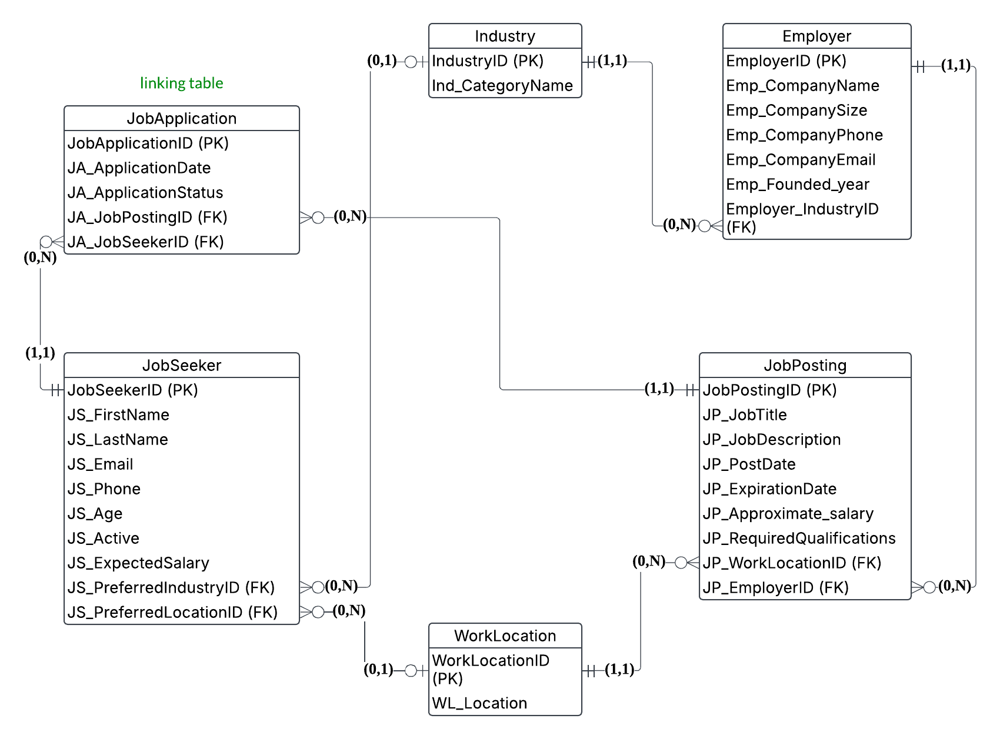

# 💼 Job Portal Database Project

This repository contains the SQL schema and data dump for a job search relational database designed by **Angel Huang** as part of the LIS751 course project.

---

## 📌 Project Overview

The **Job Portal Database** is designed to support job seekers in finding employment opportunities and to assist employers in recruiting qualified candidates. It includes comprehensive details on job seekers, employers, job postings, industries, and work locations.

---

## 🎯 Mission Objectives

1. Maintain complete employer information including company name, size, contact info, and industry.
2. Classify employers by industry category to support industry-specific searches.
3. Store job posting details such as title, description, salary range, work location, and required qualifications.
4. Maintain job location details to support regional and remote job searches.
5. Track job seeker information including name, age, contact info, preferred industries, and locations to personalize job matches.

---

## 🗂️ Entity-Relationship Diagram (ERD)

---

## 🛠️ Schema Overview

The database includes the following tables:

- `JobSeeker`
- `Employer`
- `JobPosting`
- `Industry`
- `WorkLocation`
- `JobApplication` *(linking table between JobSeeker and JobPosting)*

All schema definitions and relationships are included in [Job_Portal_Database.sql](Job_Portal_Database.sql).

---

## 📊 Example SQL Views

The following example queries demonstrate the use of views to analyze and extract meaningful data:

1. **Young job seekers in tech industry**
2. **Employers offering remote jobs**
3. **Job seekers with interviews scheduled**
4. **Industries with more than 2 job seekers**
5. **Highest paying job and employer**
6. **Employers with multiple job postings**
7. **Job postings in healthcare industry**

Refer to the [Design report](Job_Portal_DesignReport.pdf) for full query definitions.

---

## 📁 Files Included

| File                          | Description                                         |
|-------------------------------|-----------------------------------------------------|
| `Job_Portal_Database.sql`     | SQL schema and data dump for the project            |
| `Job_Portal_ERD.png`          | ER Diagram showing table structure and relationships|
| `Jod_Portal_DesignReport.pdf` | Full project report including queries and goals     |

---

## 🧠 How to Use

1. Clone this repository
2. Open MySQL Workbench
3. Use the **"Data Import"** feature to import the `Job_Portal_Database.sql` file
4. Explore the schema, run queries, or create new views!
"" 
